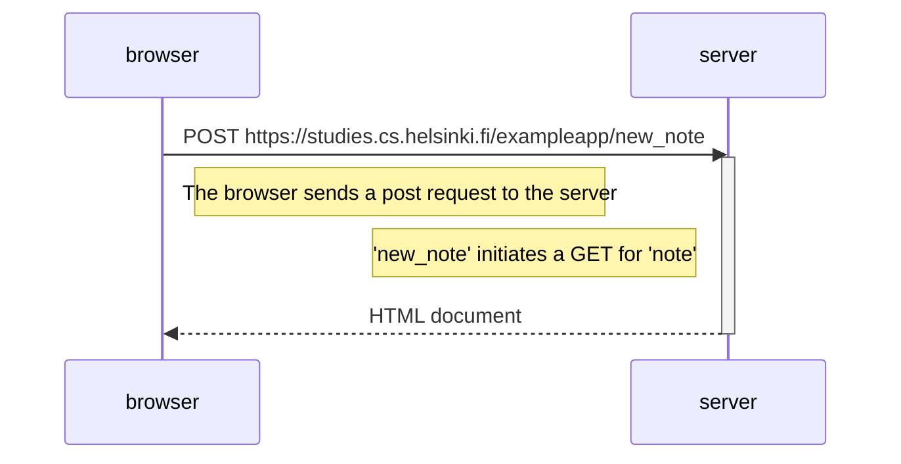

```mermaid
sequenceDiagram
	browser->>server: POST https://studies.cs.helsinki.fi/exampleapp/new_note
	activate server

	Note right of browser: The browser sends a post request to the server

	Note left of server: 'new_note' initiates a GET for 'note'	

	server-->>browser: HTML document
	deactivate server

```
